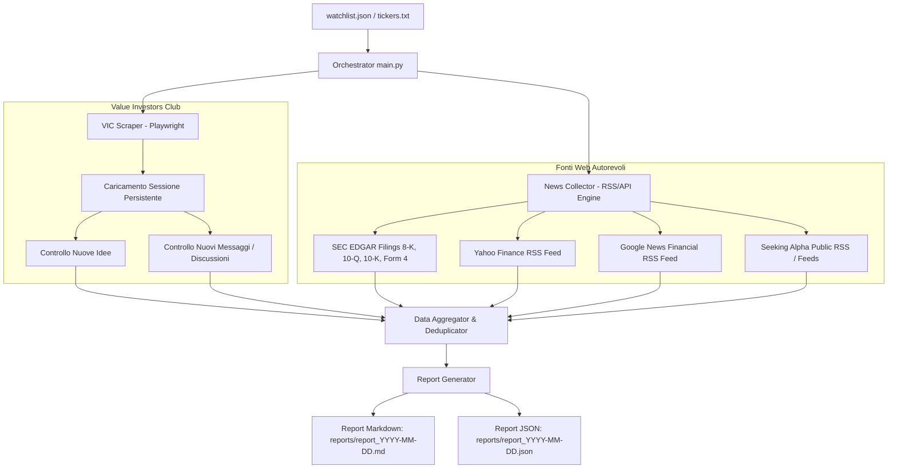

# Piano di Implementazione: Automazione Monitoraggio Value Investors Club & News Finanziarie

Realizzazione di uno strumento Python modulare per il controllo quotidiano dell'account personale su **Value Investors Club (VIC)** e la raccolta integrata di notizie e comunicati da fonti finanziarie autorevoli, strettamente filtrati su una **watchlist di ticker**.

---

## 1. Analisi dei Requisiti e Architettura

### Flusso Generale
1. **Caricamento Watchlist**: Lettura da `watchlist.json` (o `tickers.txt`) contenente i ticker di interesse e metadati (es. nome azienda, data ultimo controllo).
2. **Modulo VIC (Playwright)**:
   - Gestione sessione persistente (`persistent_context` / storage state) per mantenere login e bypassare controlli bot/Cloudflare.
   - Monitoraggio delle sezioni:
     - **Nuove Idee ("Ideas")**: Ricerca di tesi di investimento pubblicate per i ticker monitorati.
     - **Nuovi Messaggi/Commenti ("Messages")**: Estrazione dei commenti e discussioni recenti legate alle idee dei ticker in watchlist.
3. **Modulo Web News & Feeds (Multi-source pulito)**:
   - Query parallele su fonti istituzionali e finanziarie tramite feed RSS/API strutturate (evita scraping fragile, velocizza l'esecuzione e previene blocchi IP).
4. **Aggregazione & Deduplicazione**: Filtro temporale (es. ultime 24-48 ore) e associazione precisa per ticker.
5. **Generazione Report**:
   - Report leggibile in **Markdown** (`reports/report_YYYY-MM-DD.md`).
   - Report strutturato in **JSON** (`reports/report_YYYY-MM-DD.json`) per eventuali integrazioni o notifiche future (es. Telegram, email).



---

## 2. Strategia Autenticazione VIC & Gestione Cloudflare

Per garantire accesso affidabile senza incorrere in blocchi Cloudflare o captcha continui:
1. **Modalità Login Interattivo (`python main.py --login`)**:
   - Avvia un browser visibile (headful) con un profilo persistente memorizzato nella cartella locale `.vic_profile/` (o salvataggio di `storage_state.json`).
   - L'utente esegue l'accesso manualmente una sola volta inserendo le proprie credenziali personali e superando eventuali challenge Cloudflare/2FA.
   - I cookie di sessione, token di autenticazione e fingerprint del browser vengono salvati localmente.
2. **Esecuzione Quotidiana (`python main.py --run`)**:
   - Riapre il contesto browser utilizzando il profilo già autenticato.
   - Utilizza user-agent realistici, viewport standard e tempi di attesa basati sugli stati effettivi della pagina (`wait_for_selector`, `wait_for_load_state("domcontentloaded")`, piccoli delay randomizzati di jitter).

---

## 3. Selezione Fonti Web Finanziarie Autorevoli

Per monitorare notizie e feed in modo solido, pulito e senza incorrere in blocchi o paywall aggressivi, utilizzeremo:

1. **SEC EDGAR (U.S. Securities and Exchange Commission)**:
   - *Tipologia*: Comunicazioni societarie ufficiali e mandatory filings.
   - *Focus*: Form **8-K** (eventi materiali improvvisi, annunci aziendali, trimestrali), **10-Q/10-K** (relazioni trimestrali/annuali), **Form 4** (insider trading).
   - *Metodo*: Feed ufficiale RSS / JSON API SEC (`data.sec.gov`), massima autorevolezza e assenza di rumore.
2. **Yahoo Finance RSS Feeds**:
   - *Tipologia*: Notizie di mercato e analisi aziendali in tempo reale.
   - *Endpoint*: `https://feeds.finance.yahoo.com/rss/2.0/headline?s={ticker}&region=US&lang=en-US`
   - *Vantaggi*: Formato pulito, veloce, include titoli di agenzie primarie (Reuters, Bloomberg, PR Newswire).
3. **Google News Financial Search RSS**:
   - *Tipologia*: Aggregatore di notizie recenti con filtro temporale.
   - *Endpoint*: Query RSS mirata (`{ticker} stock when:2d` o `{company_name} financial`), cattura articoli da testate internazionali e comunicati stampa.
4. **Seeking Alpha RSS / Open Feeds**:
   - *Tipologia*: Analisi degli investitori e trascrizioni conferenze/earnings call.
   - *Endpoint*: `https://seekingalpha.com/api/sa/combined/{ticker}.xml` per notizie e analisi relative al ticker.

---

## 4. Struttura del Progetto Proposta

```text
100-finance-notifications/
├── config.py                 # Parametri globali (timeout, percorsi, intervalli date)
├── watchlist.json            # Lista ticker con metadati (es. simbolo, nome, note)
├── tickers.txt               # Formato alternativo semplice (un ticker per riga)
├── requirements.txt          # Dipendenze: playwright, feedparser, rich, pydantic, ecc.
├── src/
│   ├── __init__.py
│   ├── auth.py               # Helper gestione profilo persistente e setup login VIC
│   ├── vic_client.py         # Scraper Playwright per idee e messaggi VIC
│   ├── news_engine.py        # Aggregatore feed RSS/SEC filings per i ticker
│   ├── aggregator.py         # Filtraggio, normalizzazione e deduplicazione
│   └── reporter.py           # Generazione report Markdown e JSON
├── reports/                  # Cartella di output giornaliero
└── main.py                   # CLI principale (comandi: --login, --run, --add-ticker, ecc.)
```

---

## 5. Formato dei Dati e dei Report

### Formato Watchlist (`watchlist.json`)
```json
[
  {
    "ticker": "AAPL",
    "name": "Apple Inc.",
    "enabled": true
  },
  {
    "ticker": "GOOGL",
    "name": "Alphabet Inc.",
    "enabled": true
  }
]
```
*(Supportato anche `tickers.txt` riga per riga per massima semplicità)*.

### Formato Report Giornaliero (`reports/report_YYYY-MM-DD.md`)
- **Sommario esecutivo**: Numero di novità trovate su VIC e sul Web suddivise per ticker.
- **Sezione VIC - Nuove Idee ("Ideas")**: Ticker, titolo idea, autore, data, link diretto, abstract/tesi sintetica.
- **Sezione VIC - Nuovi Messaggi / Discussioni ("Messages")**: Ticker, titolo discussione, autore ultimo post, data, link al commento.
- **Sezione Notizie Finanziarie & SEC Filings**:
  - Ticker raggruppati con data, titolo notizia, fonte (SEC / Yahoo / ecc.), link diretto e breve snippet.

---

## 6. Piano dei Passaggi per la Fase 2 (Implementazione)

1. **Step 1: Configurazione ambiente & Dipendenze**
   - Creazione di `requirements.txt` (`playwright`, `feedparser`, `beautifulsoup4`, `rich`, `requests`).
   - Predisposizione di `config.py` e template `watchlist.json` / `tickers.txt`.
2. **Step 2: Modulo Gestione Autenticazione & VIC Scraper (`src/vic_client.py` e `src/auth.py`)**
   - Implementazione del login persistente interattivo.
   - Implementazione della navigazione sicura su VIC (ricerca idee e messaggi per ticker o parsing feed idee recenti filtrato sulla watchlist).
   - Estrazione robusta con selettori resilienti e gestione di eventuali variazioni nel DOM.
3. **Step 3: Modulo News & Feeds (`src/news_engine.py`)**
   - Implementazione del client SEC EDGAR per 8-K, 10-Q, Form 4.
   - Implementazione del parser Yahoo Finance e Google News RSS.
   - Normalizzazione dei dati in modelli strutturati (Timestamp, Ticker, Titolo, URL, Fonte, Snippet).
4. **Step 4: Motore di Aggregazione e Reporting (`src/reporter.py` e `src/aggregator.py`)**
   - Deduplicazione delle notizie e ordinamento cronologico.
   - Generazione file Markdown ben formattato e file JSON strutturato.
5. **Step 5: CLI Principale (`main.py`) e Script di Avvio**
   - Gestione parametri riga di comando (`--login`, `--run`, `--tickers`, `--dry-run`, `--days`).
   - Logging chiaro a terminale con formattazione visiva.

---

## Verification Plan

### Test Automatizzati & Locali
1. **Verifica Watchlist Loader**: Test del caricamento sia da `watchlist.json` che da `tickers.txt`.
2. **Verifica News Engine**: Esecuzione su un set di ticker di prova (es. `AAPL`, `MSFT`, o ticker specificati dall'utente) per validare l'estrazione da Yahoo Finance, Google News e SEC filings senza errori di rete o parsing.
3. **Verifica Modulo VIC**:
   - Test del flusso `--login` per verificare la creazione e il salvataggio della sessione persistente.
   - Test di apertura e navigazione su VIC con sessione salvata per confermare che l'autenticazione persista.
4. **Verifica Generazione Report**: Controllo del rendering dei file `reports/report_YYYY-MM-DD.md` e `.json`.
